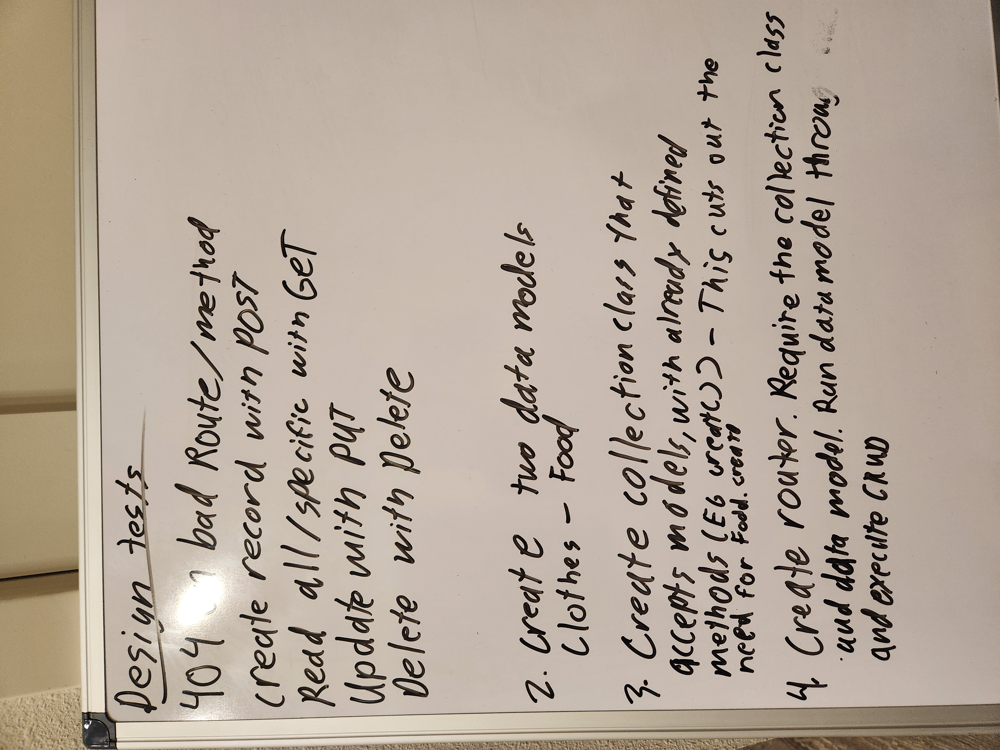

# api-server  

## Whiteboard  

## Running  

To run the code the thing you need to do is set your own port. 

## Modules  

There is a model created for both food and clothes. These are then pushed into a collection that gives them CRUD methods. From there the individual collections are imported into the routes folder which is then imported and used in the server.js file. The server.js file is intialized in the index.js file at root.  

Deployed Link: https://github.com/AdrianCosme5850/api-server/pull/2